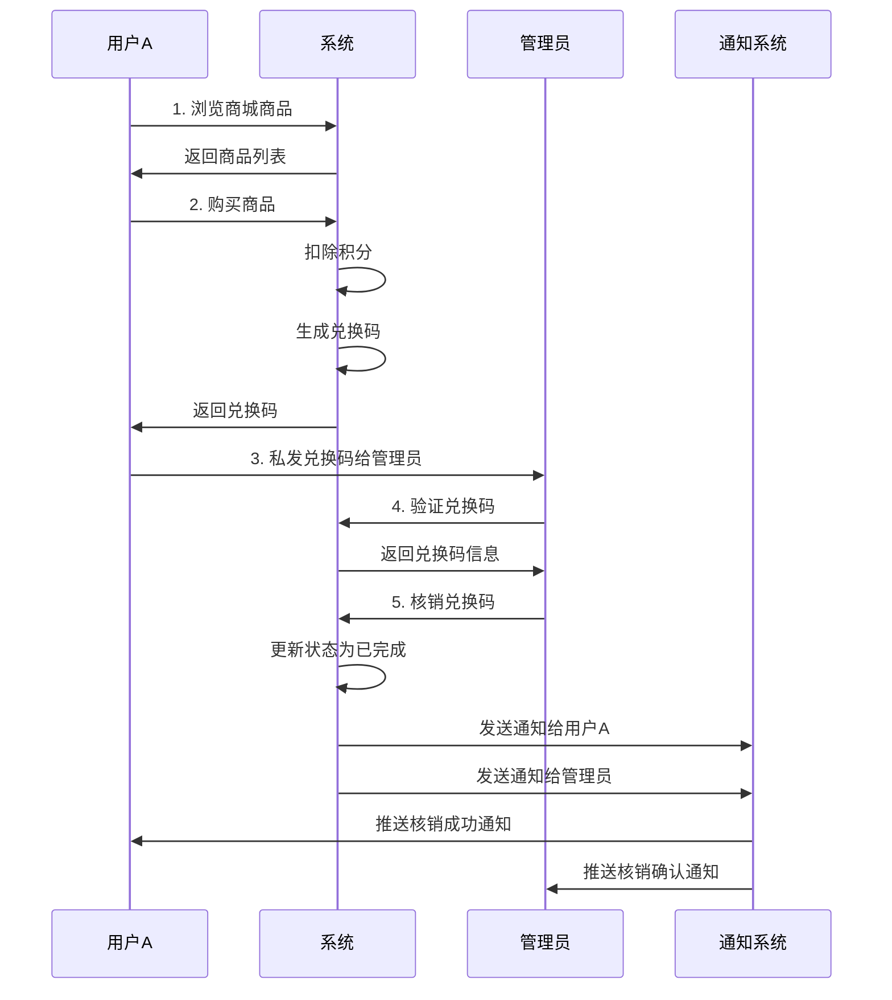

# 积分商城业务流程文档

## 1. 业务概述

积分商城是 PerfPulseAI 系统的核心功能之一，允许用户使用积分兑换各种商品和服务。系统支持完整的购买、核销、通知流程。

## 2. 核心业务流程

### 2.1 完整兑换流程



### 2.2 详细步骤说明

#### 步骤1：用户浏览和购买
1. **浏览商品**: 用户访问积分商城，查看可用商品
2. **选择商品**: 用户选择心仪的商品，查看积分要求
3. **确认购买**: 用户确认购买，系统验证积分余额
4. **扣除积分**: 系统扣除相应积分
5. **生成兑换码**: 系统生成唯一的兑换码（格式：`ITEM-XXXXXXXX`）
6. **返回结果**: 用户获得兑换码和购买记录

#### 步骤2：兑换码传递
1. **获取兑换码**: 用户在购买记录中查看兑换码
2. **联系管理员**: 用户通过私信、邮件等方式将兑换码发送给管理员
3. **说明商品**: 用户向管理员说明所购买的商品类型

#### 步骤3：管理员核销
1. **验证兑换码**: 管理员使用验证接口检查兑换码有效性
2. **确认信息**: 管理员确认商品信息和用户信息
3. **执行核销**: 管理员调用核销接口完成兑换
4. **更新状态**: 系统将购买状态从 `PENDING` 更新为 `COMPLETED`

#### 步骤4：通知发送
1. **用户通知**: 系统向购买用户发送核销成功通知
2. **管理员通知**: 系统向管理员发送核销确认通知
3. **实时推送**: 通过 SSE 实时推送通知（如果用户在线）
4. **持久化存储**: 通知保存到数据库，用户可在通知中心查看

## 3. 数据模型

### 3.1 购买记录 (PointPurchase)

```sql
CREATE TABLE point_purchases (
    id VARCHAR(36) PRIMARY KEY,
    user_id INTEGER NOT NULL,
    item_id VARCHAR(50) NOT NULL,
    item_name VARCHAR(200) NOT NULL,
    item_description TEXT,
    points_cost INTEGER NOT NULL,  -- 后端存储格式（放大10倍）
    transaction_id VARCHAR(36),
    status ENUM('PENDING', 'COMPLETED', 'CANCELLED') DEFAULT 'PENDING',
    redemption_code VARCHAR(50) UNIQUE NOT NULL,
    delivery_info JSON,
    created_at DATETIME NOT NULL,
    completed_at DATETIME,
    FOREIGN KEY (user_id) REFERENCES users(id)
);
```

### 3.2 通知记录 (Notification)

```sql
CREATE TABLE notifications (
    id VARCHAR(36) PRIMARY KEY,
    user_id INTEGER NOT NULL,
    type ENUM('REDEMPTION', 'POINTS', 'SYSTEM', 'ANNOUNCEMENT', 'PERSONAL_DATA', 'PERSONAL_BUSINESS') NOT NULL,
    title VARCHAR(200) NOT NULL,
    content TEXT NOT NULL,
    status ENUM('UNREAD', 'READ', 'ARCHIVED') DEFAULT 'UNREAD',
    extra_data JSON,
    created_at DATETIME NOT NULL,
    read_at DATETIME,
    FOREIGN KEY (user_id) REFERENCES users(id)
);
```

## 4. 状态管理

### 4.1 购买状态流转

```
PENDING (待核销)
    ↓ (管理员核销)
COMPLETED (已完成)

PENDING (待核销)
    ↓ (取消购买)
CANCELLED (已取消) → 退还积分
```

### 4.2 通知状态流转

```
UNREAD (未读)
    ↓ (用户查看)
READ (已读)
    ↓ (用户归档)
ARCHIVED (已归档)
```

## 5. 通知机制详解

### 5.1 通知类型

#### 用户通知（购买者）
- **标题**: "兑换码核销成功"
- **内容**: "您的兑换码已被管理员核销，商品：{商品名称}"
- **类型**: `REDEMPTION`
- **额外数据**:
  ```json
  {
    "type": "redemption_verified",
    "item": "商品名称",
    "redemptionCode": "兑换码",
    "adminName": "管理员姓名",
    "verifiedAt": "核销时间"
  }
  ```

#### 管理员通知
- **标题**: "核销操作完成"
- **内容**: "您已成功核销用户 {用户名} 的兑换码，商品：{商品名称}"
- **类型**: `REDEMPTION`
- **额外数据**:
  ```json
  {
    "type": "redemption_admin_confirmed",
    "item": "商品名称",
    "redemptionCode": "兑换码",
    "buyerName": "购买用户姓名",
    "buyerEmail": "购买用户邮箱",
    "verifiedAt": "核销时间"
  }
  ```

### 5.2 通知推送机制

1. **数据库存储**: 通知首先保存到数据库
2. **SSE 实时推送**: 如果用户在线，通过 Server-Sent Events 实时推送
3. **通知中心**: 用户可在通知中心查看所有历史通知
4. **状态管理**: 支持已读/未读状态管理

## 6. 错误处理

### 6.1 常见错误场景

1. **积分不足**: 购买时积分余额不够
2. **商品不存在**: 购买不存在的商品
3. **兑换码无效**: 核销时兑换码不存在或已使用
4. **权限不足**: 非管理员尝试核销
5. **重复核销**: 尝试核销已完成的兑换码

### 6.2 错误响应格式

```json
{
  "detail": "错误描述",
  "status_code": 400
}
```

## 7. 安全考虑

### 7.1 兑换码安全
- 兑换码使用 UUID 生成，确保唯一性和随机性
- 兑换码一次性使用，核销后立即失效
- 支持兑换码有效期设置（可扩展）

### 7.2 权限控制
- 用户只能查看自己的购买记录
- 管理员可以查看所有购买记录
- 核销操作需要管理员权限

### 7.3 积分安全
- 积分扣除和退还都有完整的事务记录
- 支持积分一致性检查
- 防止重复扣除和恶意操作

## 8. 监控和日志

### 8.1 关键操作日志
- 商品购买日志
- 兑换码核销日志
- 积分变动日志
- 通知发送日志

### 8.2 业务指标监控
- 商品购买量统计
- 核销成功率
- 平均核销时间
- 用户活跃度

## 9. 用户体验优化

### 9.1 界面交互优化
- **兑换成功提示**: Toast消息只显示商品名称，不显示兑换码，避免信息泄露
- **通知中心**: 完整的兑换信息（包括兑换码）在通知中心查看
- **时区显示**: 所有时间自动转换为中国时区（UTC+8）显示
- **点击跳转**: 通知中心的通知支持点击跳转到详情页面并高亮显示

### 9.2 安全性考虑
- **兑换码保护**: 兑换码仅在通知中心和购买记录中显示，
- **权限控制**: 只有购买者和管理员能查看兑换码详情
- **操作日志**: 所有敏感操作都有完整的审计日志

## 10. 扩展功能

### 10.1 已实现功能
- ✅ 基础商品购买
- ✅ 兑换码生成和核销
- ✅ 双向通知机制
- ✅ 购买记录管理
- ✅ 积分事务处理
- ✅ 用户体验优化（Toast简化、时区转换、通知跳转）

### 10.2 可扩展功能
- 🔄 商品库存管理
- 🔄 批量核销功能
- 🔄 兑换码有效期
- 🔄 商品分类和搜索
- 🔄 用户评价系统
- 🔄 促销和折扣系统
