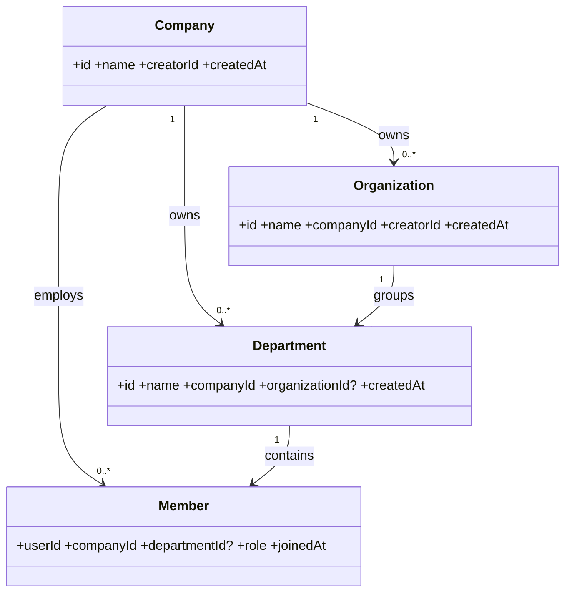

# 组织管理模块设计说明

本说明作为组织管理模块的设计与实现指南，追求“简单、清晰、可维护”。

## 1. 模块目标与边界

- 目标（业务补充）
  - 公司全生命周期：支持公司创建、加入、退出、切换；
  - 组织全生命周期：创建/修改/删除，强绑定当前公司；
  - 部门全生命周期：首个部门需选择公司，后续部门可继承 companyId；禁止创建“无公司部门”
  - 成员管理：用户先加入公司，方可加入该公司下部门；成员切换公司时自动退出原公司全部部门
  - 批量关联：仅保留部门“批量关联公司”入口，统一将全部部门关联至所选公司
  - 准入与邀请：加入公司不需要邀请码；仅“未加入任何公司时”加入组织需校验组织类邀请码
  - 权限使用面：当前仅在“部门管理”启用权限校验；组织/公司变更需创建者或被授权者操作
  - 业务操作授权：商城商品审核、上/下架、积分调整需具备授权；兑奖核销需具备授权
  - 数据展示：部门页支持成员信息折叠详情；入公司后显示当前公司下的全部部门
  - 统计与导出：组织/部门支持按时间区间统计与导出，避免与自定义时间统计重复呈现
  - 审计追踪：公司加入/切换/退出、组织与部门的创建/删除、授权/回收等关键动作记录审计日志
- 边界（业务补充）
  - 作用域限制：组织/部门/成员关系均严格在单一公司作用域内，禁止跨公司操作
  - 组织绑定：组织必须绑定公司；切换公司需确保其下部门 companyId 同步，否则阻止操作
  - 部门约束：删除部门需保证无在册成员或完成迁移；不提供行级单条“关联公司”操作
  - 成员规则：成员不可加入其他公司的部门；成员切换公司后原公司内的组织/部门访问立即失效
  - 权限范围：不提供全局通用 RBAC，仅在“部门管理”范围做最小必要授权与校验
  - 集成边界：不实现积分/兑奖/通知的业务规则，仅提供权限控制点与可订阅事件
  - 数据边界：不承担历史跨公司数据迁移与清洗；如需跨公司迁移，需独立迁移方案
  - 目录与展示：不展示与当前公司无关的部门/组织；不展示用户无访问权限的公司
  - 组织层级：当前仅支持“组织 → 部门”两级结构，不支持多级嵌套（如需扩展另行评估）
  - 角色体系：不提供部门内自定义角色体系（后续可按需扩展）
  - 外部联系：不支持外部访客或跨企业组织成员模式（后续如需另行设计）

## 2. 术语与关系模型

- 公司 Company：企业级容器，平台中的顶层实体。
- 组织 Organization：公司内的业务单元。严格绑定单一公司（组织不能跨公司）。创建新组织时自动绑定当前公司；后续如切换公司需权限且需二次确认。
- 部门 Department：公司内的成员管理单元，严格隶属于单一公司；可选归属某一组织用于分组（如业务需要）。
- 成员 Member：用户加入公司后，方可加入该公司下的部门（不得加入其他公司的部门）。

关系约束（口径统一）：

- 公司 1 — n 组织（组织强绑定单一公司）
- 公司 1 — n 部门（部门强绑定单一公司）
- 组织 1 — n 部门（可选的分组维度）
- 部门 1 — n 成员；公司 1 — n 成员

数据模型概览（Mermaid）：



## 3. 访问控制与路由

- 路由：/org
- 认证：/org 与 /companies 路由需登录验证。
- 公司成员态：
  - 未加入公司：
    - /org 显示“公司加入界面”（直接加入，无需邀请码）；加入成功后自动重定向到组织管理。
    - 如涉及组织邀请场景，仅在“未加入任何公司”时才需校验组织类的邀请码。
  - 已加入公司：
    - /org 显示组织管理，屏蔽公司加入界面。
- 顶部右侧按钮顺序（/org 页面）：公司管理 > 关联公司 > 兑奖中心。

## 4. 权限模型（最小化）

- 超级管理员：公司创建者自动获得该公司的超级管理员（最高权限）。
- 权限启用范围：目前仅在“部门管理”启用权限校验；其他区域暂不强制。
- 超级管理员可为部门分配/回收管理权限。
- 需授权后方可执行的操作（举例）：
  - 积分商城：商品审核、上/下架、修改积分。
  - 兑奖管理：奖品核销。

## 5. 关键业务流程

### 5.1 公司

- 创建公司：记录创建者；创建公司不会自动加入该公司，需手动点击“加入公司”。
- 加入公司：无需邀请码；若用户已属于另一家公司，弹出确认对话框提示“加入新公司将导致原公司成员关系失效”。
- 切换公司：与加入相同弹窗逻辑，保留审计记录。
- 退出公司：支持主动退出，退出后无法访问该公司部门/组织。

### 5.2 组织管理

- 创建：默认绑定当前公司；不可创建“无公司组织”。
- 修改/删除：仅组织创建者与被授予权限的用户可操作。
- 切换公司：需二次确认，明确影响范围与后果（例如与其下部门的公司一致性处理）。
- 统计与导出：提供时间区间统计、导出能力（避免与自定义时间的统计重复呈现）。
- 过滤器：按要求将通用过滤器移动到“成员”区块更贴近使用场景。

### 5.3 部门管理

- 创建：
  - 第一条部门需明确选择公司；
  - 其后新建默认继承已有部门的公司Id；
  - 禁止创建“无公司部门”。
- 公司关联：仅支持“批量关联”入口（页面右上角“关联公司”），一次性将全部部门关联到所选公司；移除表格行级别的单条关联操作。
- 数据来源：对接后端 departments 表（权威数据来源）。
- 成员管理：用户必须先加入公司，才可加入该公司下的部门；禁止加入非当前公司的部门。
- 展示：部门页成员信息支持折叠详情；加入后显示当前公司下的所有部门。

流程示意（加入/切换公司）：

```mermaid
flowchart TD
  A[已登录?] -->|否| L[跳转登录]
  A -->|是| B{已加入公司?}
  B -->|否| C[展示加入公司入口]
  C --> D[直接加入(无邀请码)] --> E[重定向 /org]
  B -->|是| F[展示组织管理]
  F --> G{需要切换公司?}
  G -->|是| H[弹出确认框]
  H -->|确认| I[切换公司并记录审计]
  H -->|取消| F
  G -->|否| F
```

## 6. UI 与交互规范

- 对话框：删除确认、公司/组织切换确认、公司关联操作均使用弹窗（不使用浏览器 alert）。
- 图标：公司与部门使用可辨识的不同图标。
- 选择范围：公司关联弹窗仅展示“当前用户创建或可访问”的公司列表。
- 文案：首次组织-公司绑定避免不必要的警示；当进行“公司切换”时显示明确的风险提示与上下文说明。

## 7. API 契约（示例，统一 camelCase）

- GET /api/companies → { id, name, creatorId }
- POST /api/companies/join → { companyId }
- POST /api/companies/switch → { companyId, confirm: true }
- GET /api/organizations?companyId= → 列表
- POST /api/organizations → { name, companyId? }（默认取当前公司）
- GET /api/departments?companyId=&organizationId?=
- POST /api/departments → { name, companyId, organizationId? }

返回字段、错误码使用统一的 camelCase，错误信息需可读且可定位。

## 8. 审计与数据一致性

- 记录关键操作：创建/删除组织与部门、公司加入/切换/退出、敏感权限授权与回收。
- 一致性：公司切换需保证组织与部门的公司Id一致性策略明确；变更前弹窗告知影响。

## 9. 与周边系统的集成点

- 积分与兑奖：由本模块提供权限控制点；事件（上/下架、核销）产生日志，必要时发通知。
- 通知中心：按照“公告 / 个人资料 / 个人业务”分类，组织与部门变化可投递相应通知。

## 10. 实现约束与质量保证（贴合 new_rules）

- 简单实用，避免过度设计；控制圈复杂度，函数短小、可复用、少重复。
- 合理运用设计模式；避免无效 try/except；前后端统一使用 camelCase。
- 仅在部门管理强校验权限，其他区域保持最小可用闭环。
- 提供单元测试/接口契约测试；迁移文件合并优化，减少碎片化。

## 11. 交付检查清单（Checklist）

- [ ] 路由与访问控制符合规范，未登录/未入公司分流正确。
- [ ] 组织强绑定公司，创建/切换均有确认与权限校验。
- [ ] 部门只允许批量公司关联入口；数据接入 departments 表；成员限制符合公司作用域。
- [ ] 顶部按钮顺序与 UI 交互符合约定；使用弹窗而非 alert；图标区分明显。
- [ ] API 入参/出参 camelCase；错误提示可读；关键操作有审计日志。
- [ ] 统计/导出与过滤器位置符合规范，避免重复统计展示。
