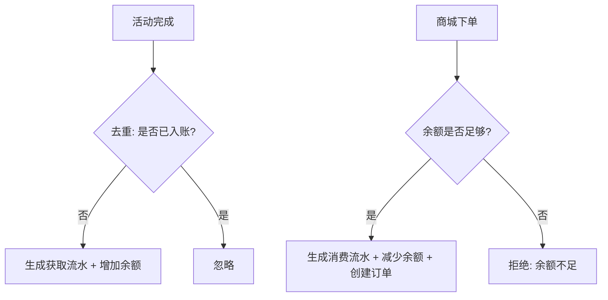
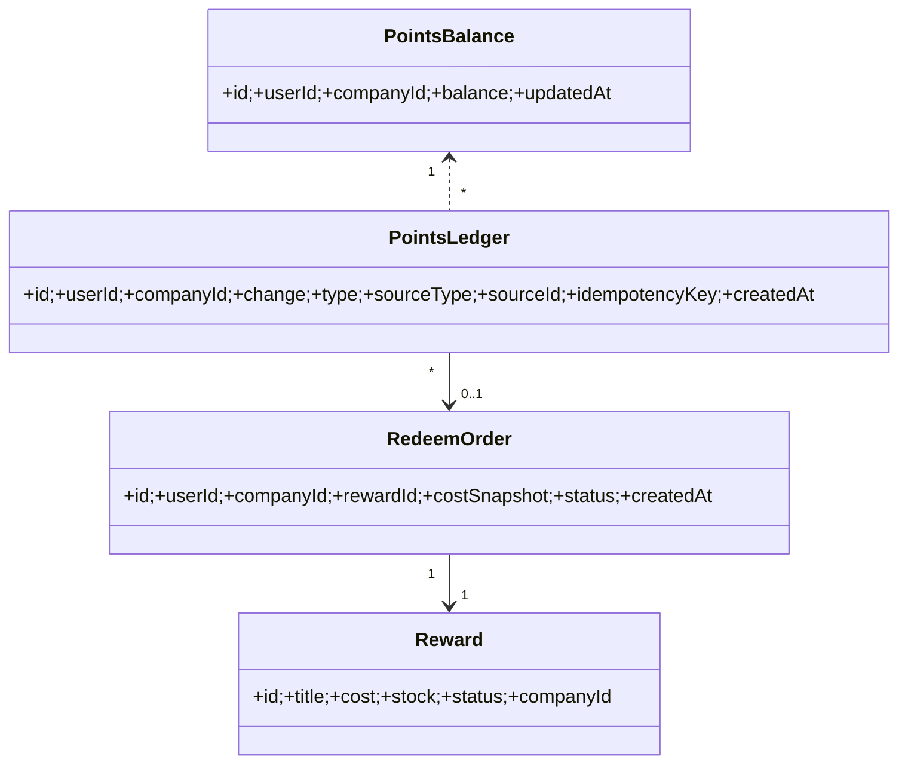

## 积分功能设计（简洁实用版）

### 1. 核心概念与边界

- 公司/部门约束：
  - 用户需“已加入公司”才能使用积分相关功能（获取/消费/查看）。
  - 用户积分按公司维度隔离：同一用户在不同公司拥有各自独立积分余额与流水。
  - 部门仅用于展示/筛选，不改变积分账务口径。
- 来源与消费：
  - 现阶段积分来源仅限“活动（activity）”；后续可扩展“任务（task）”。
  - 积分消费发生在“积分商城（rewards）”，每次消费对余额做原子扣减；余额不可为负。
- 记录与幂等：
  - 每一笔获取/消费都以“流水（ledger）”记录；余额（balance）可通过累计计算或旁路表维护。
  - 同一来源只可计入一次（按 sourceType + sourceId + userId + companyId 做唯一约束/幂等键）。

### 单位与转换约定

- 前端展示、交互、API 返回统一使用“显示值”（带 1 位小数）。
- 后端数据库与内部计算统一使用“存储值”（整数，按显示值×10 存储）。
- 严禁在代码中手写 /10 或 ×10，请统一使用 PointConverter：
  - to_storage(display) → storage
  - to_display(storage) → display
  - format_for_api(storage) → 保留 1 位小数的显示值
- 服务层与 API 约定：
  - PointService 的统计接口返回显示值。
  - MallService 的 get_mall_statistics / get_user_mall_summary / get_company_statistics 返回显示值（例如 totalPointsSpent、currentBalance、totalPoints）。
  - API 层不做二次换算，直接透传服务层的显示值。
- 退款/回滚等从“存储值”入账的场景，必须显式标注 is_display_amount=False，避免重复×10。

---

### 前端部分

在dashboard 中积分系统里面，积分明细中的数据 获取积分和消费积分的总记录
可以快捷筛选获取和消费的记录

积分商城，里面具体管理员设计的商品，有对应的积分；
兑换明细 是联通积分商城的商品具体兑换详情

### 2. 数据模型（最小可用）

- points_ledger（积分流水）
  - id, userId, companyId, change, type: "earn"|"spend", sourceType: "activity"|"task", sourceId, createdAt
  - idempotencyKey = hash(userId, companyId, sourceType, sourceId, type)
- points_balance（积分余额旁路表）
  - id, userId, companyId, balance, updatedAt
- rewards（可兑换物）
  - id, title, description, cost, stock, status: "on"|"off", companyId(optional: 公共/公司私有)
- redeem_orders（兑换订单）
  - id, userId, companyId, rewardId, costSnapshot, status: "created"|"canceled"|"fulfilled", createdAt

说明：

- 字段统一 camelCase；数值型 change 正为获取、负为消费；消费只通过订单产生，便于对账与售后。

---

### 3. 业务规则（关键）

- 获取（earn）
  
  - 仅当用户已加入 companyId 时允许入账。
  - 幂等：同一来源（sourceType+sourceId+userId+companyId）只允许一次“earn”。

- 消费（spend）
  
  - 下单前需检查用户在当前 companyId 下的可用余额 ≥ reward.cost。
  - 成功则：写入一条 spend 流水（负数 change），扣减 balance，同步创建 redeemOrder。
  - 失败则：不落账，返回“余额不足/奖品下线/库存不足”。

- 库存与订单
  
  - 下单采用“余额扣减 + 库存扣减”原子流程；若库存先行扣减失败需回滚余额（同事务）。
  - 订单状态流转：created → fulfilled（发货/发码）/canceled（超时/手动取消）。

- 权限
  
  - 普通用户：仅能查看自己的余额/流水、创建兑换；
  - 部门管理仅影响组织数据权限，不额外干预积分账务。

- 核准
  
  - 对活动积分有异议 三个月内容可以重新计算积分，超过三个月，则无法重新计算积分，但是可重新AI评分，但积分不变
  - 超过三个月的总积分要计算一下
  - 定期清理超过三个月的积分变更的数据

---

### 4. API 设计（后端返回 camelCase）

- GET /api/points/overview
  - req: none（根据登录态与当前公司）
  - resp: { totalEarned, totalSpent, balance }
- GET /api/points/ledger
  - query: { page, pageSize, type?, dateFrom?, dateTo?, keyword? }
  - resp: { list: [{ id, change, type, sourceType, sourceId, createdAt }], total }
- POST /api/points/accrue（内部/服务调用）
  - body: { userId, companyId, sourceType: "activity", sourceId, points }
  - resp: { ok: true, idempotent: boolean }
- POST /api/points/redeem
  - body: { rewardId }
  - resp: { orderId, balance }
- GET /api/rewards
  - query: { page, pageSize, status?: "on"|"off" }
  - resp: { list: [{ id, title, cost, stock, status }], total }
- GET /api/redeemOrders
  - query: { page, pageSize, status?, dateFrom?, dateTo?, keyword? }
  - resp: { list: [{ id, rewardId, costSnapshot, status, createdAt }], total }
  - 说明：costSnapshot 为“显示值”，由 PointConverter.format_for_api(o.points_cost) 统一转换。

备注：所有接口需鉴权；/api/points/accrue 可限制为后端服务或有权限角色调用。

---

### 5. 前端页面与交互

- 总览（Overview）
  - 展示：可用余额（balance）、累计获取（totalEarned）、累计支出（totalSpent）。
- 流水（Ledger）
  - 列表 + 筛选（type、日期范围、关键字）；导出按钮放在同区域。
  - 仅在“兑换记录”区域放置筛选与搜索，避免重复在其他区域出现。
- 积分商城（Rewards）
  - 展示可兑换奖品（仅当前公司可见的）；支持搜索/排序（按 cost/上架时间）。
  - 兑换流程：点击兑换 → 二次确认 → 调用 redeem → 成功 toast 与跳转到“兑换记录”。
- 兑换记录（Redeem Orders）
  - 展示订单状态与创建时间；可按时间范围导出；支持取消未处理订单（可选）。

---

### 6. 统计与导出

- 统计口径在“组织管理”页进行（公司维度聚合：总获取/总消费/净额、时间段对比）。
- 自定义日期区间内，仅在“兑换记录/流水”页面提供导出入口，避免重复展示同类统计部件。
- 导出格式：CSV（UTF-8 BOM），字段统一 camelCase。

---

### 7. 幂等与一致性实现要点

- 入账幂等：以 idempotencyKey 唯一索引保障；若冲突则返回 { ok: true, idempotent: true }。
- 余额一致性：
  - 事务内先写流水再更新余额；失败整体回滚。
  - 定时校验：按天对比 sum(ledger.change) 与 balance，差异入审计表。

---

### 8. 错误码建议

- 401 未登录 / 403 未加入公司 / 409 已入账 / 422 参数错误
- 409-BALANCE_NOT_ENOUGH / 409-REWARD_OFFLINE / 409-OUT_OF_STOCK

---

### 9. 示例用例（10 条）

1) 活动首次完成入账：earn 100 → 余额=100 → 返回 ok。
2) 同活动重复回放：earn 100（相同 sourceId）→ 幂等命中 → 余额不变 → 返回 idempotent=true。
3) 兑换成功：余额100，兑换 cost=60 → 余额=40，生成订单 created。
4) 余额不足兑换：余额50，兑换 cost=60 → 拒绝 BALANCE_NOT_ENOUGH，余额=50。
5) 奖品下线：reward.status=off → 拒绝 REWARD_OFFLINE。
6) 库存不足：stock=0 → 拒绝 OUT_OF_STOCK。
7) 未加入公司：访问任何积分接口 → 403。
8) 不同公司隔离：公司A余额100，公司B余额0 → 在B不可用余额支付。
9) 导出记录：选择日期范围 → 生成 CSV，字段 camelCase。
10) 余额校验：sum(ledger)=100，但 balance=90 → 记录审计差异，提示修复。

---

### 10. 后续扩展

- 新来源：任务（task）与运营活动（marketing），仅需在 sourceType 扩展并复用幂等键。
- 订单履约：支持自动发码/物流对接；订单状态流转新增“failed/returned”。
- 风控：限额、黑名单、防刷（频控 + 设备指纹，可选）。
